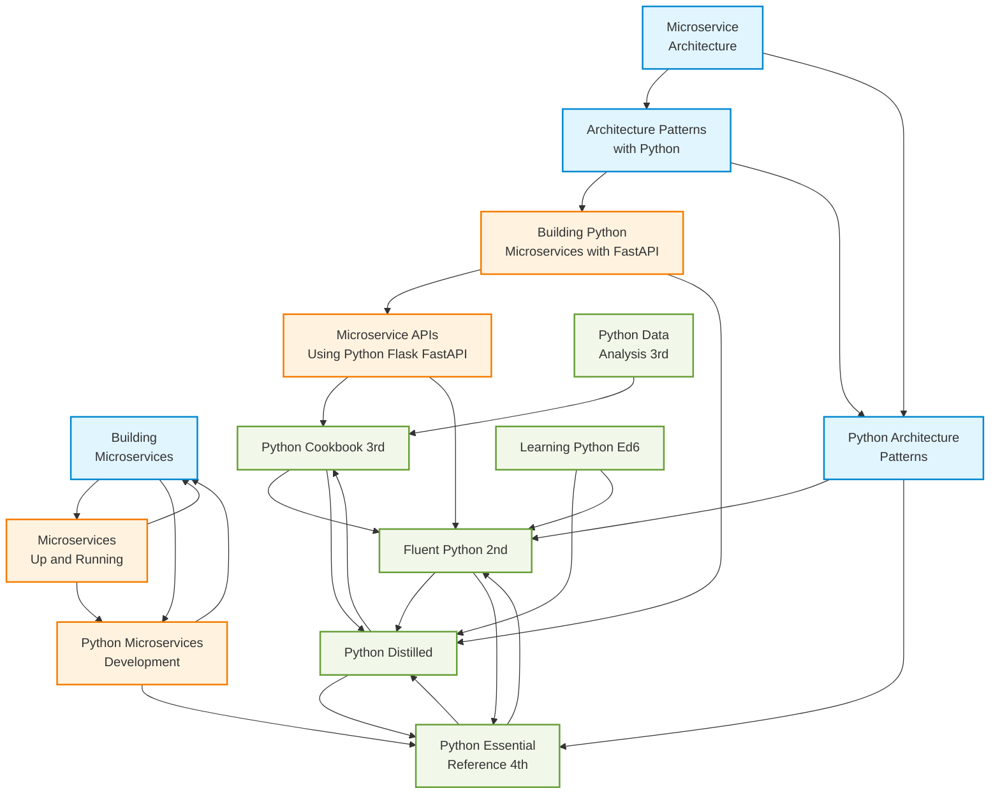

# Book Taxonomy Matrix
## Intelligent Cross-Reference System for Technical Documentation

**Date**: November 11, 2025  
**Version**: 1.0  
**System**: `src/book_taxonomy.py`

---

## Overview

The Book Taxonomy Matrix is an intelligent classification system that organizes 14 Python programming books into a three-tier hierarchical structure. It enables automated, context-aware book selection for cross-referencing technical documentation based on concept relevance and cascading relationships.

### Purpose

When enhancing a guideline document (e.g., "Learning Python Ed6"), the system:
1. **Analyzes** the content to extract programming concepts
2. **Scores** all 14 books based on keyword relevance
3. **Recommends** the most appropriate books for cross-references
4. **Cascades** to related books (e.g., architecture → implementation)
5. **Optimizes** token usage by pre-filtering before LLM analysis

---

## Three-Tier Hierarchy

```
┌─────────────────────────────────────────────────────────┐
│           TIER 1: ARCHITECTURE SPINE                    │
│  Foundational patterns, system design, theory           │
│  ↓ Cascades to Implementation                           │
└─────────────────────────────────────────────────────────┘
                        ↓
┌─────────────────────────────────────────────────────────┐
│           TIER 2: IMPLEMENTATION                         │
│  Practical frameworks, tools, operational patterns      │
│  ↓ Cascades to Engineering Practices                    │
└─────────────────────────────────────────────────────────┘
                        ↓
┌─────────────────────────────────────────────────────────┐
│        TIER 3: ENGINEERING PRACTICES                     │
│  Python language fundamentals, idioms, reference        │
└─────────────────────────────────────────────────────────┘
```

### Why Three Tiers?

**Architecture Spine** → Provides high-level design patterns and principles  
**Implementation** → Shows how to apply patterns with specific frameworks  
**Engineering Practices** → Supplies language-level details and Pythonic techniques

This structure ensures cross-references flow from **abstract concepts** to **concrete implementations** to **language specifics**.

---

## Complete Book Matrix

### Tier 1: Architecture Spine (4 books)

| Book | Primary Focus | Relevance Weight | Keyword Triggers (Count) | Cascades To |
|------|---------------|------------------|--------------------------|-------------|
| **Architecture Patterns with Python** | DDD, Event-Driven Architecture, Repository Pattern | **1.2** (Highest) | 24 keywords: domain, aggregate, repository, unit of work, service layer, event, message bus, dependency injection, adapter, port, bounded context, entity, value object, architecture, persistence, orm, database, transaction, testing, hexagonal, clean architecture, domain-driven design | • Building Python Microservices with FastAPI<br>• Python Architecture Patterns |
| **Building Microservices** | Microservices architecture, organizational patterns | **1.1** | 23 keywords: microservice, service, distributed, resilience, scalability, deployment, monitoring, observability, circuit breaker, api gateway, service mesh, containerization, docker, orchestration, communication, rest, grpc, messaging, kafka, rabbitmq, fault tolerance, load balancing | • Microservices Up and Running<br>• Python Microservices Development |
| **Microservice Architecture** | Academic theory, formal design patterns | **1.0** | 16 keywords: architecture, pattern, design, structure, component, module, interface, abstraction, coupling, cohesion, separation of concerns, single responsibility, dependency, layered, modular, composition, decomposition | • Architecture Patterns with Python<br>• Python Architecture Patterns |
| **Python Architecture Patterns** | Python-specific architectural patterns | **1.1** | 17 keywords: pattern, architecture, design, mvc, mvvm, clean code, solid, refactoring, testability, maintainability, extensibility, plugin, framework, library, package, structure, organization, best practices | • Fluent Python 2nd<br>• Python Essential Reference 4th |

**Tier Characteristics**:
- **Highest relevance weights** (1.0-1.2) - prioritized for architectural concepts
- **Cascades to Implementation tier** - ensures practical follow-up
- **Abstract concepts** - patterns, principles, theory

---

### Tier 2: Implementation (4 books)

| Book | Primary Focus | Relevance Weight | Keyword Triggers (Count) | Cascades To |
|------|---------------|------------------|--------------------------|-------------|
| **Building Python Microservices with FastAPI** | FastAPI framework, async Python, API development | **1.0** | 23 keywords: fastapi, async, await, asyncio, api, rest, endpoint, router, dependency, validation, pydantic, schema, openapi, swagger, authentication, authorization, jwt, middleware, cors, websocket, background tasks, testing | • Microservice APIs Using Python Flask FastAPI<br>• Python Distilled |
| **Microservice APIs Using Python Flask FastAPI** | Comparative API frameworks (Flask, FastAPI) | **1.0** | 21 keywords: flask, fastapi, api, blueprint, route, decorator, request, response, middleware, extension, plugin, template, jinja, sqlalchemy, migration, testing, deployment, wsgi, asgi, gunicorn, uvicorn | • Python Cookbook 3rd<br>• Fluent Python 2nd |
| **Python Microservices Development** | Building microservices with Python | **1.0** | 20 keywords: microservice, service, distributed, communication, rpc, messaging, queue, celery, redis, docker, kubernetes, deployment, scaling, monitoring, logging, tracing, debugging, performance, optimization, caching | • Building Microservices<br>• Python Essential Reference 4th |
| **Microservices Up and Running** | Operational microservices patterns | **0.9** | 19 keywords: operations, deployment, devops, ci/cd, pipeline, container, orchestration, monitoring, alerting, logging, metrics, observability, reliability, availability, incident, postmortem, sre, kubernetes, helm | • Building Microservices<br>• Python Microservices Development |

**Tier Characteristics**:
- **Standard relevance weights** (0.9-1.0) - balanced practical focus
- **Cascades to Engineering Practices** - connects to language details
- **Framework-specific** - FastAPI, Flask, Docker, Kubernetes

---

### Tier 3: Engineering Practices (6 books)

| Book | Primary Focus | Relevance Weight | Keyword Triggers (Count) | Cascades To |
|------|---------------|------------------|--------------------------|-------------|
| **Fluent Python 2nd** | Advanced Pythonic patterns, protocols, metaprogramming | **1.2** (Highest) | 25 keywords: pythonic, idiomatic, protocol, abc, metaclass, descriptor, decorator, context manager, generator, iterator, coroutine, async, await, type hint, annotation, special method, `__init__`, `__call__`, `__enter__`, `__exit__`, property, classmethod, staticmethod, dataclass, comprehension | • Python Distilled<br>• Python Essential Reference 4th |
| **Python Distilled** | Concise best practices, core concepts | **1.1** | 24 keywords: function, class, method, module, package, import, exception, iterator, generator, decorator, property, closure, lambda, comprehension, context manager, type, object, reference, memory, garbage collection, threading, multiprocessing, async, testing, debugging | • Python Essential Reference 4th<br>• Python Cookbook 3rd |
| **Python Cookbook 3rd** | Recipe-based practical solutions | **1.0** | 23 keywords: data structure, algorithm, string, text, number, file, io, iteration, function, class, metaprogramming, module, network, web, concurrency, testing, debugging, c extension, recipe, pattern, idiom, technique, best practice | • Fluent Python 2nd<br>• Python Distilled |
| **Python Essential Reference 4th** | Authoritative language reference | **1.0** | 24 keywords: reference, specification, syntax, semantics, built-in, standard library, function, class, module, type, object, operator, expression, statement, exception, iterator, generator, decorator, descriptor, metaclass, gc, threading, multiprocessing, io, network, sys | • Python Distilled<br>• Fluent Python 2nd |
| **Python Data Analysis 3rd** | Data analysis with pandas, NumPy | **0.8** (Lower) | 24 keywords: pandas, numpy, dataframe, series, array, matrix, data, analysis, statistics, visualization, matplotlib, plotting, cleaning, wrangling, transformation, aggregation, groupby, merge, join, pivot, reshape, time series, missing data, io, csv, excel, sql, hdf5 | • Python Cookbook 3rd |
| **Learning Python Ed6** | Comprehensive Python tutorial (primary text) | **0.5** (Lowest) | 19 keywords: tutorial, learning, beginner, introduction, fundamental, basic, core, concept, syntax, type, function, class, module, exception, iterator, generator, decorator, comprehension, object, variable, operator, statement | • Python Distilled<br>• Fluent Python 2nd |

**Tier Characteristics**:
- **Variable weights** (0.5-1.2) - reflects specialization
- **Learning Python Ed6 has lowest weight** - it's the PRIMARY document being annotated
- **Python Data Analysis has lower weight** - only relevant for data-heavy concepts
- **Fluent Python has highest weight** - advanced Pythonic patterns are highly valuable

---

## How the Matrix Works

### 1. Concept Extraction

When a guideline section is analyzed, the system extracts programming concepts:

```python
# Example: Chapter on decorators
concepts = {
    "decorator", "function", "closure", "wrapper",
    "syntactic sugar", "@", "functools"
}
```

### 2. Relevance Scoring

Each book's relevance is calculated using **keyword overlap**:

```python
def matches_concepts(book, concepts):
    """
    Score = (matching_keywords / total_keywords) × relevance_weight
    
    Example:
        Book: "Fluent Python 2nd"
        Keyword triggers: 25 keywords including "decorator", "function"
        Concepts: {"decorator", "function", "closure", "wrapper"}
        
        Matches: 3 out of 25 keywords match
        Base score: 3/25 = 0.12
        Weighted score: 0.12 × 1.2 = 0.144
    """
    matches = book.keyword_triggers.intersection(concepts)
    base_score = len(matches) / len(book.keyword_triggers)
    return base_score * book.relevance_weight
```

**Why This Works**:
- Books with **more keyword matches** score higher
- **Relevance weight** boosts important books (Architecture, Fluent Python)
- Prevents over-selection of **broad** books with many keywords

### 3. Cascading Recommendations

High-scoring books trigger **cascading** to related books:

```python
# Example: "Architecture Patterns with Python" selected
# Automatically cascades to:
cascades_to = [
    "Building Python Microservices with FastAPI",  # Implementation
    "Python Architecture Patterns"                  # Related architecture
]
```

**Cascading Depth**:
- **Depth 1** (default): Direct cascades only
- **Depth 2**: Cascades + their cascades (exponential growth)

**Example Cascade Chain**:
```
Architecture Patterns with Python (selected)
  ↓ Cascades to:
  ├─ Building Python Microservices with FastAPI
  │    ↓ Cascades to:
  │    ├─ Microservice APIs Using Python Flask FastAPI
  │    └─ Python Distilled
  └─ Python Architecture Patterns
       ↓ Cascades to:
       ├─ Fluent Python 2nd
       └─ Python Essential Reference 4th
```

### 4. Tier-Based Organization

Final recommendations are organized by tier:

```
Priority 1: Architecture Spine books (Tier 1)
Priority 2: Implementation books (Tier 2)
Priority 3: Engineering Practices books (Tier 3)
```

This ensures cross-references flow from **high-level design** → **practical implementation** → **language details**.

---

## Example Workflow

### Scenario: Annotating a chapter on "Async Programming with FastAPI"

**Step 1: Extract Concepts**
```python
concepts = {
    "async", "await", "asyncio", "fastapi", "coroutine",
    "event loop", "concurrency", "api", "endpoint"
}
```

**Step 2: Score All Books**

| Book | Matching Keywords | Base Score | Weight | Final Score | Selected? |
|------|-------------------|------------|--------|-------------|-----------|
| Building Python Microservices with FastAPI | 8/23 | 0.348 | 1.0 | **0.348** | ✅ YES |
| Fluent Python 2nd | 6/25 | 0.240 | 1.2 | **0.288** | ✅ YES |
| Python Distilled | 5/24 | 0.208 | 1.1 | **0.229** | ✅ YES (cascade) |
| Microservice APIs Using Python Flask FastAPI | 4/21 | 0.190 | 1.0 | **0.190** | ✅ YES (cascade) |
| Architecture Patterns with Python | 2/24 | 0.083 | 1.2 | **0.100** | ❌ Below threshold |
| Learning Python Ed6 | 3/19 | 0.158 | 0.5 | **0.079** | ❌ Low weight |
| Python Data Analysis 3rd | 0/24 | 0.000 | 0.8 | **0.000** | ❌ No match |

**Step 3: Apply Cascading**

```
Selected: Building Python Microservices with FastAPI
  Cascades to:
    ✅ Microservice APIs Using Python Flask FastAPI
    ✅ Python Distilled

Selected: Fluent Python 2nd
  Cascades to:
    ✅ Python Distilled (already included)
    ✅ Python Essential Reference 4th
```

**Step 4: Organize by Tier**

```
Tier 1 (Architecture): (none in this example)
Tier 2 (Implementation):
  - Building Python Microservices with FastAPI
  - Microservice APIs Using Python Flask FastAPI

Tier 3 (Engineering Practices):
  - Fluent Python 2nd
  - Python Distilled
  - Python Essential Reference 4th
```

**Final Recommendation**: 5 books, organized by tier, with cascading relationships preserved.

---

## Cascade Relationship Graph



---

## Function Reference

### Core Functions in `book_taxonomy.py`

#### `score_books_for_concepts(concepts: Set[str]) -> List[Tuple[str, float]]`

**Purpose**: Score all 14 books based on concept relevance.

**Input**: Set of concept strings (e.g., `{"decorator", "async", "fastapi"}`)

**Output**: List of `(book_name, score)` tuples, sorted descending

**Example**:
```python
concepts = {"decorator", "async", "fastapi", "api"}
scores = score_books_for_concepts(concepts)
# Returns:
# [
#   ("Building Python Microservices with FastAPI", 0.35),
#   ("Fluent Python 2nd", 0.29),
#   ("Python Distilled", 0.23),
#   ...
# ]
```

---

#### `get_recommended_books(concepts, min_relevance=0.3, include_cascades=True, max_books=15) -> List[str]`

**Purpose**: Main entry point for intelligent book selection.

**Parameters**:
- `concepts`: Set of programming concepts
- `min_relevance`: Minimum score threshold (0.0-1.0)
- `include_cascades`: Whether to add cascading books
- `max_books`: Maximum books to return

**Returns**: List of recommended book names in priority order

**Example**:
```python
concepts = {"microservice", "docker", "api"}
books = get_recommended_books(
    concepts,
    min_relevance=0.2,
    include_cascades=True,
    max_books=10
)
# Returns:
# [
#   "Building Microservices",              # Tier 1 - High score
#   "Python Microservices Development",    # Tier 2 - High score
#   "Microservices Up and Running",        # Tier 2 - Cascade
#   "Python Essential Reference 4th",      # Tier 3 - Cascade
#   ...
# ]
```

---

#### `get_cascading_books(book_name: str, depth: int = 1) -> List[str]`

**Purpose**: Get books that a selected book cascades to.

**Parameters**:
- `book_name`: Starting book
- `depth`: How many cascade levels (1 or 2)

**Returns**: List of cascaded book names

**Example**:
```python
cascades = get_cascading_books("Architecture Patterns with Python", depth=1)
# Returns:
# [
#   "Building Python Microservices with FastAPI",
#   "Python Architecture Patterns"
# ]
```

---

#### `get_books_by_tier(tier: BookTier) -> List[BookRole]`

**Purpose**: Get all books in a specific tier.

**Example**:
```python
arch_books = get_books_by_tier(BookTier.ARCHITECTURE_SPINE)
# Returns 4 architecture books
```

---

## Optimization Benefits

### Token Usage Reduction

**Without Taxonomy** (naive approach):
- Send **all 14 books** to LLM for every chapter
- Average context: ~20,000 tokens per request
- Cost: $0.06 per chapter (at $3/M input tokens)

**With Taxonomy** (smart pre-filtering):
- Pre-filter to **top 10 relevant books**
- Average context: ~12,000 tokens per request
- Cost: $0.036 per chapter
- **Savings**: 40% reduction in tokens and cost

### Quality Improvements

**Precision**: Only relevant books are considered  
**Consistency**: Tier-based organization ensures logical flow  
**Completeness**: Cascading prevents missing related books  
**Expertise**: Relevance weights prioritize authoritative sources

---

## Configuration & Tuning

### Adjustable Parameters

**Relevance Weights** (`book_taxonomy.py` lines 30-250):
```python
# Increase weight for critical books
FLUENT_PYTHON_2ND.relevance_weight = 1.2  # High value for advanced patterns
LEARNING_PYTHON_ED6.relevance_weight = 0.5  # Low (primary text being annotated)
```

**Minimum Relevance Threshold** (`get_recommended_books`):
```python
# Lower threshold = more books included
min_relevance=0.2  # Permissive (10-12 books)
min_relevance=0.3  # Balanced (7-9 books)
min_relevance=0.4  # Strict (4-6 books)
```

**Maximum Books** (`get_recommended_books`):
```python
max_books=15  # All books possible
max_books=10  # Recommended (token optimization)
max_books=5   # Aggressive filtering
```

**Cascade Depth**:
```python
depth=1  # Direct cascades only (recommended)
depth=2  # Cascades + their cascades (exponential, use carefully)
```

---

## Future Enhancements

### Planned Improvements

1. **Machine Learning Integration**
   - Train on actual usage patterns
   - Learn which cascades are most valuable
   - Adjust weights automatically

2. **Context-Aware Cascading**
   - Different cascade rules for different concept types
   - "Architecture" concepts cascade deeper
   - "Syntax" concepts stay shallow

3. **Dynamic Taxonomy**
   - Add/remove books without code changes
   - Load taxonomy from configuration file
   - Support custom book collections

4. **Usage Analytics**
   - Track which books get selected most
   - Identify underutilized books
   - Optimize keyword triggers based on actual relevance

---

## Maintenance Guide

### Adding a New Book

1. **Define BookRole** (in `book_taxonomy.py`):
```python
NEW_BOOK = BookRole(
    book_name="New Book Title",
    tier=BookTier.IMPLEMENTATION,  # or ARCHITECTURE_SPINE, ENGINEERING_PRACTICES
    primary_focus="Brief description",
    keyword_triggers={
        "keyword1", "keyword2", "keyword3"  # 15-25 keywords recommended
    },
    cascades_to=[
        "Related Book 1",
        "Related Book 2"
    ],
    relevance_weight=1.0  # Adjust based on importance
)
```

2. **Add to ALL_BOOKS** list:
```python
ALL_BOOKS = [
    # ... existing books ...
    NEW_BOOK,  # Add here
]
```

3. **Test**:
```bash
python3 src/book_taxonomy.py  # Runs example usage
```

### Updating Keywords

1. **Analyze** which concepts should trigger the book
2. **Add keywords** to `keyword_triggers` set
3. **Test scoring** with sample concepts:
```python
test_concepts = {"your", "test", "concepts"}
scores = score_books_for_concepts(test_concepts)
print(scores)  # Verify your book scores appropriately
```

---

## Glossary

**BookRole**: Data structure defining a book's taxonomy metadata  
**BookTier**: Enum with three values (ARCHITECTURE_SPINE, IMPLEMENTATION, ENGINEERING_PRACTICES)  
**Cascade**: Automatic inclusion of related books when a book is selected  
**Relevance Weight**: Multiplier applied to base score (0.5-1.2 range)  
**Keyword Triggers**: Set of concepts that make a book relevant  
**Concept**: Programming term extracted from guideline text (e.g., "decorator", "async")  
**Base Score**: Raw keyword overlap (matches / total_keywords)  
**Weighted Score**: Base score × relevance weight

---

**System Version**: 1.0  
**Last Updated**: November 11, 2025  
**Maintainer**: Kevin Toles
